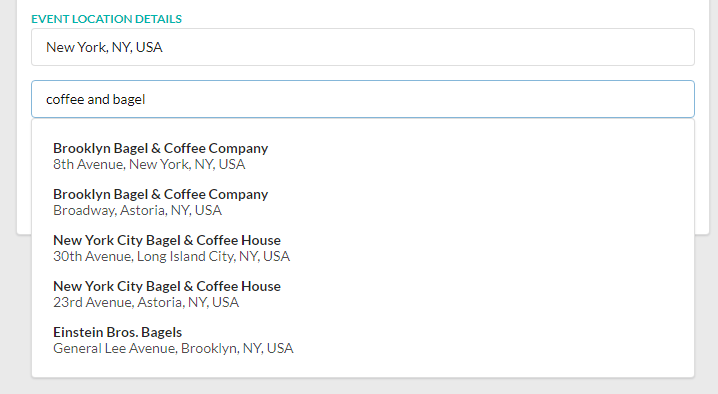
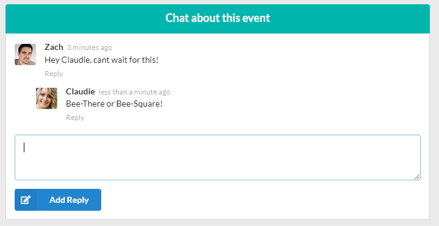
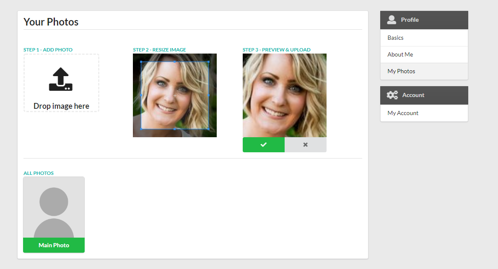
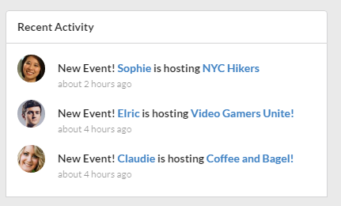
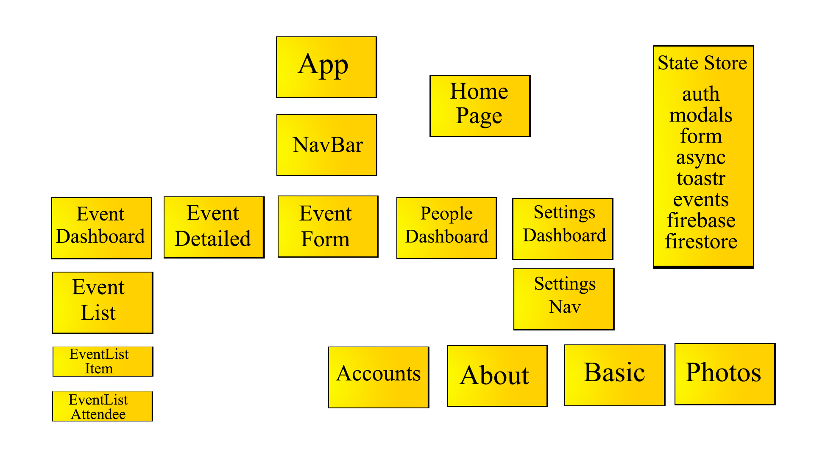
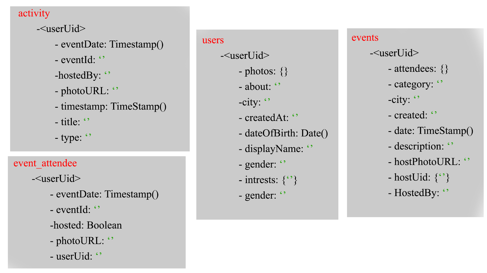

# Bee-There

Bee-There is a serverless CRUD web app that provides services for organizing in-person events. Based on Revents from [TryCatchLearn](https://github.com/trycatchLearn).

Live Site: [https://bee-thair.web.app/]

# Table of Contents

1. [Implementation](#implementation)
2. [Features](#features)
   - [Authentication](#authentication)
   - [Events](#Events)
   - [GoogleMaps](#googleMaps)
   - [LiveChat](#liveChat)
   - [PhotoUpload](#photoUpload)
   - [SiteActivity](#siteActivity)
3. [Design](#design)
   - [ReactComponents](#reactComponents)
   - [DatabaseSchema](#databaseSchema)
4. [Future Implementation](#future-Implementation)

# Implementation

Bee-There's core packages: - cuid - Redux - toastr - cropper - date-fsn - React.js - firebase - firestore - redux-form - semantic ui - google-maps - places-autocomplete

# Features

## Authentication

Authentication is handled by google firebase. Currenlty users can
register using google-login or provide an email and password. With support from Facebook and Twitter comming shortly.

## Events

Events are the core component of the application. Users can create, read, update and delete (cancel) events. Users can also go to an event hosted by another user or decide to cancel going. Events are stored firestores NoSQL database.

## GoogleMaps

When user create an event and begin to type in an hocation, google Place Autocomplete returns places prediction in response to the HTTP request. After users select the city in which the event is held, places auto-complete also constrics the venue location to the same city

## LiveChat

On the event page, users can comment and chat in real time. This is achived using redux dynamic forms. The chat is stored in firebases real time database as a JSON tree.

## PhotoUpload

Using the cropper.js libary, users can uplod a profile photo and crop it. Images are stored in the firebase cloud storage.

## SiteActivity

Recent Activity on the site is generated using firebase cloud functions; when an event changes (created, updated or deleted), on firestore (a NoSQL database), the cloud function is triggered and generated the recent activity.

# Design

## ReactComponents

Brake down of react UI components along with the redux states.

# DatabaseSchema

The Firestore is a NoSQL database that consits of an activity, event_activity, event and user collections. Each one is organized using the usersId.

Firsbase Collection Feilds:

# future-Implementation

1. Add a peoples dashboard to allow users to network
2. Site wide chat functionality
3. refactor code using react hooks
4. allow sorting/filtering of events
